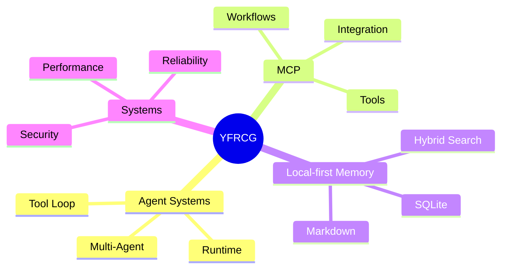

<!-- Profile README for yfrcg -->

<div align="center">


<p>
  <b>Computer Science & Technology @ Nankai University</b>
</p>

<p>
  Exploring Agent Systems, MCP, Local-first Memory, and Reliable Engineering.
</p>

<p>
  
  
  
  
</p>

</div>

---

## About Me

I am an undergraduate student in **Computer Science and Technology at Nankai University**.

My work is centered on building practical AI systems — especially **agent runtimes, MCP tools, gateway workflows, local-first memory, and secure automation**.

> I like systems that can be built, tested, explained, and improved.

---

## What I'm Building

- **Agent Runtime** — tool loops, memory, and execution workflows  
- **MCP Services** — project discovery and structured tool integration  
- **Systems Engineering** — performance optimization, verification, and reliability  

---

## Focus Map



---

## Motto

```text
Learn deeply. Build concretely. Verify relentlessly.
```

---

<div align="center">

<a href="https://github.com/yfrcg">
  
</a>

</div>
