<div align="center">



<sub>CS undergraduate · Nankai University</sub>

<br><br>

<kbd>&nbsp;TypeScript&nbsp;</kbd>&nbsp;<kbd>&nbsp;Python&nbsp;</kbd>&nbsp;<kbd>&nbsp;C / C++&nbsp;</kbd>&nbsp;<kbd>&nbsp;MCP&nbsp;</kbd>&nbsp;<kbd>&nbsp;RAG&nbsp;</kbd>&nbsp;<kbd>&nbsp;SQLite&nbsp;</kbd>&nbsp;<kbd>&nbsp;SIMD&nbsp;</kbd>

<br><br>

</div>

> *Building agent systems that remember, use tools, verify results, and leave traces.*
>
> *先跑通，再优化；先验证，再总结；先形成作品，再打磨表达。*

<br>

### Now

```text
agent runtime       gateway daemons · tool loops · session management
mcp ecosystem       building and extending Model Context Protocol servers
local-first memory  hybrid retrieval (vector + BM25) on SQLite
reliability         sandboxing · audit logs · multi-agent verification
```

I work on the underlying infrastructure of AI — turning theory into runnable, verifiable, reproducible systems. Past research experience in NLP; currently reading my way through agent memory, tool selection and routing.

<br>

### Reading

Recent paper notes — agents, memory & NLP:

&nbsp;&nbsp;**Evo-Memory** · test-time learning with self-evolving memory
&nbsp;&nbsp;<sub>not "store more", but whether agents can learn at test time via a think–act–refine loop</sub>

&nbsp;&nbsp;**SkillRouter** · skill routing for LLM agents at scale
&nbsp;&nbsp;<sub>when skills grow to the hundreds, retrieval becomes the bottleneck — bi-encoder + re-rank for skill selection</sub>

&nbsp;&nbsp;**Outcome-aware tool selection for semantic routers**
&nbsp;&nbsp;<sub>learning from outcomes as an offline embedding shift — zero params, zero latency, zero GPU at serving</sub>

&nbsp;&nbsp;**Real-CE** · Chinese-English scene text super-resolution benchmark
&nbsp;&nbsp;<sub>first real-world CN-EN text SR dataset, edge-aware learning for dense CJK strokes</sub>

<br>

### Building

| | |
|---|---|
| [**agent-rebuild**](https://github.com/yfrcg/agent-rebuild)&nbsp;&nbsp;`TypeScript` | an agent runtime built from scratch, learned from Claude Code — tool loop, sessions, gateway |
| [**Course-Project-Intelligence**](https://github.com/yfrcg/Course-Project-Intelligence)&nbsp;&nbsp;`Python` | MCP server for course-project research across universities — explainable search & repo comparison |
| [**NKUCS-PA-Lab**](https://github.com/yfrcg/NKUCS-PA-Lab)&nbsp;&nbsp;`C` | processor & system fundamentals labs, NEMU-based PA series |
| [**NKUCS-Parallel_Programming**](https://github.com/yfrcg/NKUCS-Parallel_Programming)&nbsp;&nbsp;`C++` | SIMD, OpenMP and MPI experiments with reports |

<br>

<div align="center">

&nbsp;&nbsp;

<br>


<sub>

[mail](mailto:2411080@mail.nankai.edu.cn) · [github](https://github.com/yfrcg)

</sub>

<br>

</div>
